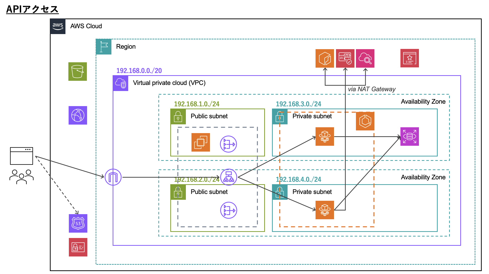
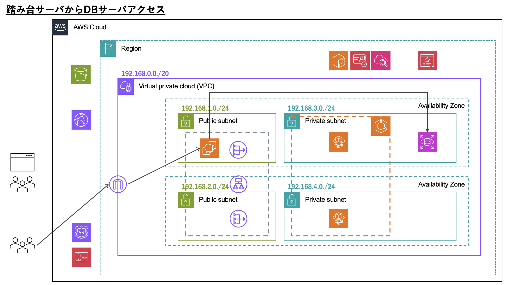

# AWS Hardening - Terraformでのインフラ構築について

AWS HardeningのインフラをTerraformで構築します。

## 初期化コマンド

```
$ terraform init
```

## 変数設定ファイル追加

`aws-hardening/terraform/` に `terraform.tfvars` を作成し、それぞれ変数を記述します。

```
project     = ""
user        = ""
db_username = ""
db_password = ""
db_port     = 3306
db_name     = ""
route_53_zone_id        = ""
us_east_1_cert_arn      = ""
ap_northeast_1_cert_arn = ""
ecr_image               = ""
domain                  = ""
```

`project` と `user` はそれぞれ任意の値を設定してください。
これらは基本的に各AWSリソースのname属性やNameタグで使用しています。

```
name = "${var.user}-${var.project}-alb"
```

```
tags = {
  Name    = "${var.user}-${var.project}-vpc" <- この部分
  Project = var.project
  User    = var.user
}
```

主な目的は、自身で作成したリソースをコンソール上で見つけやすくすることです。

`db_` から始まる変数はDBの設定値です。

`route_53_zone_id`, `us_east_1_cert_arn`, `ap_northeast_1_cert_arn`, `ecr_image` はTerraform管理外のリソース情報です。

`domain` はアカウントに紐づくドメインです。

## ssh-key作成

ローカルで公開鍵・秘密鍵を生成し、`terraform/ssh-key` に配置します。
この鍵はEC2のキーペアに使用します。
鍵名は `aws-hardening-keypair` としてください。
独自の鍵名を設定する場合は、EC2キーペアの設定内（`ec2.tf`）で指定しているファイルパスを修正してください。

```
public_key = file("./ssh-key/aws-hardening-keypair.pub")
```

## その他

### Terraformバージョン

現時点（2023/12/20）で、このソースコードが正常に動作することを確認しているTerraformバージョンは `1.6.6` です。

### AWS CLI プロファイルについて

`aws-hardening/terraform/main.tf` で使用するプロファイルを指定しています。
そのため、実行時には `profile` の設定値を自身のプロファイル名に変更、
あるいは、自身のプロファイル名を `kdl_hardening` に変更してください。

```
provider "aws" {
  profile = "kdl_hardening"
  region  = "ap-northeast-1"
}
```

## アーキテクチャとフロー

### 全体像


### フロント側アクセス


### API側アクセス



### DBアクセス



### S3コンテンツアクセス


